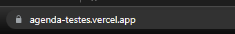
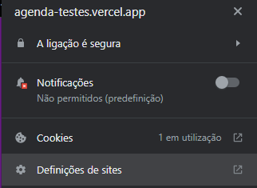
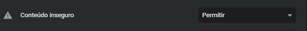

# Beleza na Agenda

### ✅ Aplicação web para que os salões de beleza e profissionais autônomos possam gerenciar suas agendas, serviços, profissionais e disponibilizar sua agenda de atendimentos no aplicativo.


### Ajustes e melhorias

O projeto ainda está em desenvolvimento e as próximas atualizações serão voltadas nas seguintes tarefas:

- [x] Agendamentos
- [x] Controle de Horários
- [x] Integração com Whatsapp
- [ ] Pagamentos
- [ ] Fidelização
- [ ] Gamificação para Profissionais
- [ ] Gestão Financeira

## 💻 Pré-requisitos

Antes de começar, verifique se você atendeu aos seguintes requisitos:


- Você instalou a versão mais recente do `<React / Node>`
- Você tem uma máquina `<Windows / Linux / Mac>`.

## 🚀 Instalando

Para instalar o belezanaagenda-ts, siga estas etapas:

Linux e macOS:

```
sudo npm install --force
```

Windows:

```
npm install --force
```

## ☕ Usando belezanaagenda-ts

Para usar belezanaagenda-ts, execute no terminal o seguinte comando para inicializar a execução do projeto

```
 npm start
```


<h3>Observações importantes!!</h3>

<p>Nosso deploy parte front end foi feito via vercel e nossa api foi implementada usando http, portanto se você estiver tentando realizar o login via link da vercel: <a>https://agenda-testes.vercel.app</a> , peço que realize os seguintes passos abaixo para conseguir efetuar o login, pois temos um error Mixed Content, justamente quando nosso site roda em https e tenta fazer requisiçoes na api via http. Caso você clone esse reposiório rodará normal na sua maquina não sendo necessário realizar os passos abaixo. 
 <ul>
     <li>
         <span>Primeiro passo: Clique em ver informações do website.</span>
         <br/>
     </li>
      <br/>
     <li>
         <span>Segundo passo: Acesse as definiçoes do site.</span>
         <br/>
     </li>
      <br/>
     <li>
         <span>Terceiro passo: permita conteudo inseguro nas permissões.</span>
     </li>
     </ul>
<p>
 Caso se sinta inseguro, coloque dados ficticios, no cadastro pedimos numero de telefone pois nosso backend envia uma mensagem no whatsapp após o agendamento realizado.        
</p>


​     


## 🤝 Colaboradores

Agradeço aos nobres e talentosíssimos colegas que contribuíram para a execução deste projeto:

<table>
  <tr>
    <td align="center">
      <a href="https://github.com/Leoodaviid">
        <br>
        <sub>
          <b>Leonardo David</b>
        </sub>
      </a>
    </td>
    <td align="center">
      <a href="https://github.com/LimaMaria">
        <br>
        <sub>
          <b>Maria Lima</b>
        </sub>
      </a>
    </td>
    <td align="center">
      <a href="https://github.com/HudsonMenezes">
        <br>
        <sub>
          <b>Hudson Menezes</b>
        </sub>
      </a>
    </td>
  </tr>
</table>
